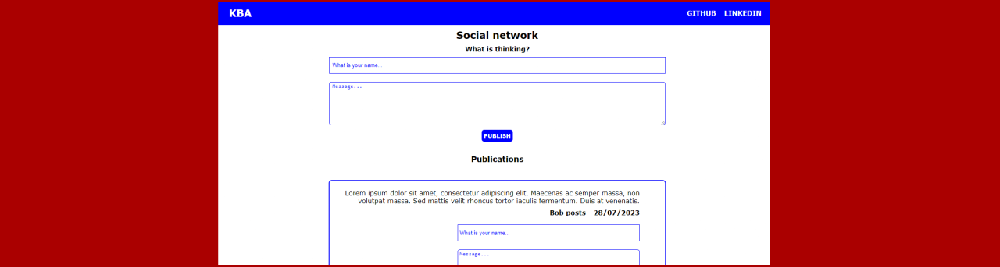
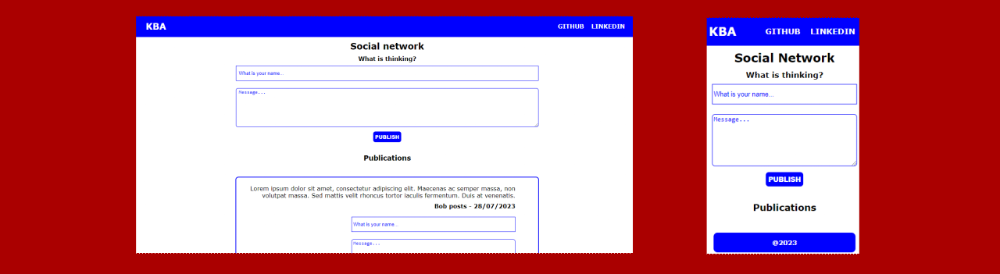

# **Social Network**

## Sobre o projeto

Projeto: [trabalho de javascript](https://javascript-social-network.vercel.app/)

A aplicação consiste em demonstrar uma rede social básica, onde o usuário insere a postagem, podendo haver comentários e respostas de comentários; e somente o usuário que criou a postagem pode removê-la.

The application consists of demonstrating a basic social network, where the user inserts the post, and there may be comments and comment responses; and only the user who created the post can remove it.

## Layout web e mobile

## Tecnologias Utilizadas

* HTML 5
* CSS 3
* Javascript
    * Uso de DOM (DOM Usage) 
    * Classe (Class)
    * Funções (Functions) 
    * Evento (Event)
        * Click

## Autor

#### **Katarine Albuquerque**

    
    &nbsp;
    

